# PracticaJenkins

RESULTAT DELS ÚLTIMS TESTS 

## Introducció a Jenkins

Jenkins és una eina de codi obert per a l'automatització de tasques, especialment útil per a la integració contínua (CI) i el lliurament continu (CD). Ofereix una àmplia gamma de plugins per integrar-se amb diverses tecnologies com GitHub, Docker i Kubernetes.

### Funcionalitats de Jenkins:

- Creació de projectes.
- Proves i lliurament de programari.
- Implementació automatitzada.

Jenkins ajuda els desenvolupadors a detectar errors en etapes primerenques del cicle de desenvolupament, millorant així la qualitat del programari.

## Configuració de la Pipeline a Jenkins

### Pas 1: Accés a Jenkins

Accedeix a Jenkins a través de "localhost:8080" si està configurat així en el teu "docker-compose.yml".
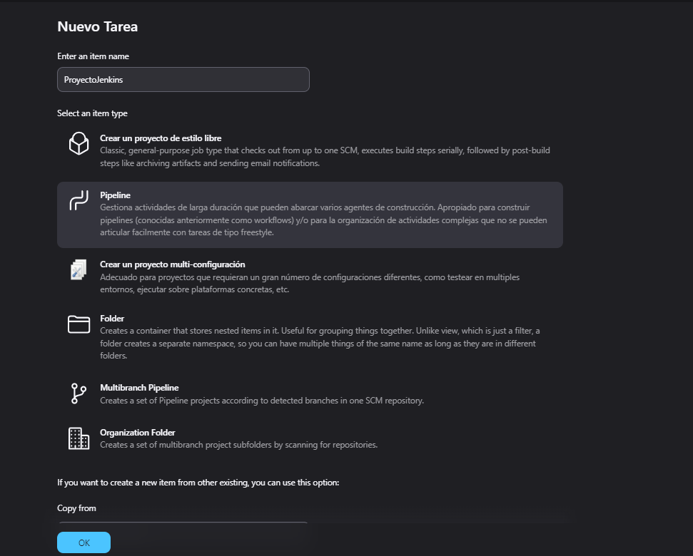

### Pas 2: Crear una nova tasca

A la pantalla principal de Jenkins, selecciona "Nova Tasca" i assigna-li un nom. Tria "Pipeline" com a tipus de tasca.

### Pas 3: Configuració de paràmetres

Configura la pipeline per acceptar paràmetres, seleccionant "Paràmetres de cadena" per a les entrades de text.
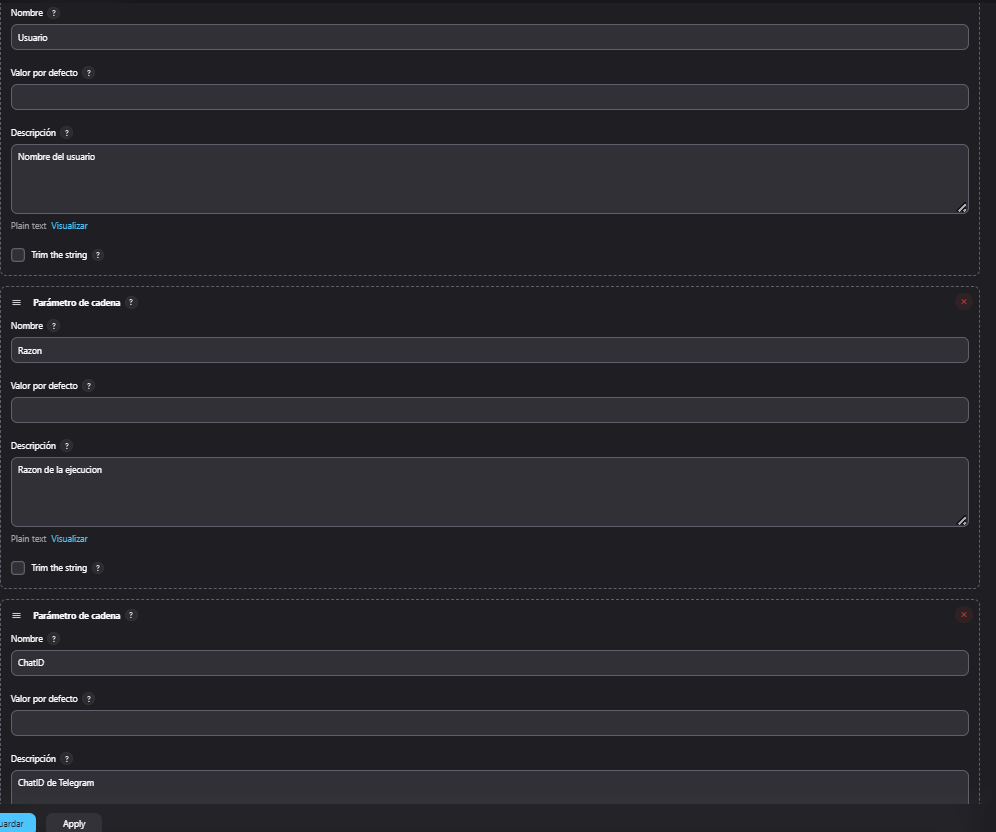

### Pas 4: Vinculació amb GitHub

Configura el repositori de GitHub amb l'enllaç correcte i la branca amb la qual treballaràs. Assegura't d'utilitzar les credencials correctes.
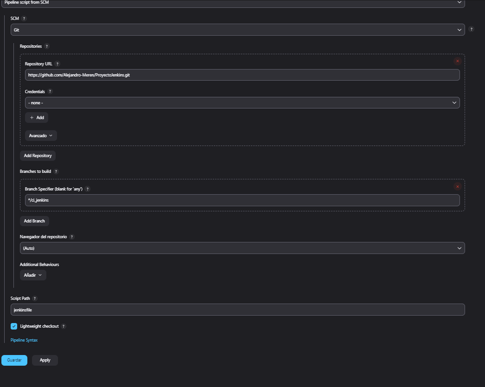
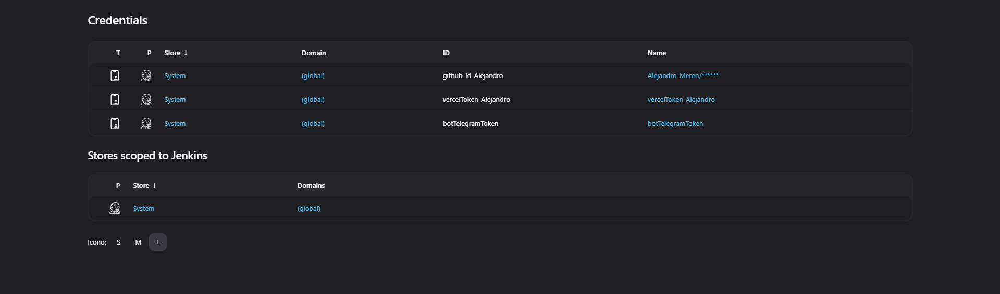

### Pas 5: Definir el script de la Pipeline

Defineix les etapes de la pipeline en el fitxer `Jenkinsfile`:

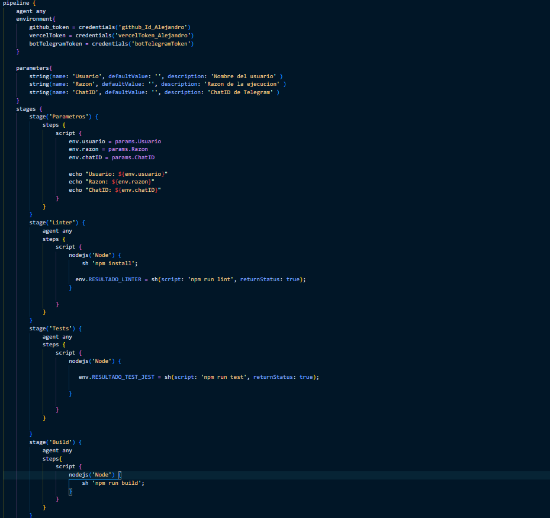
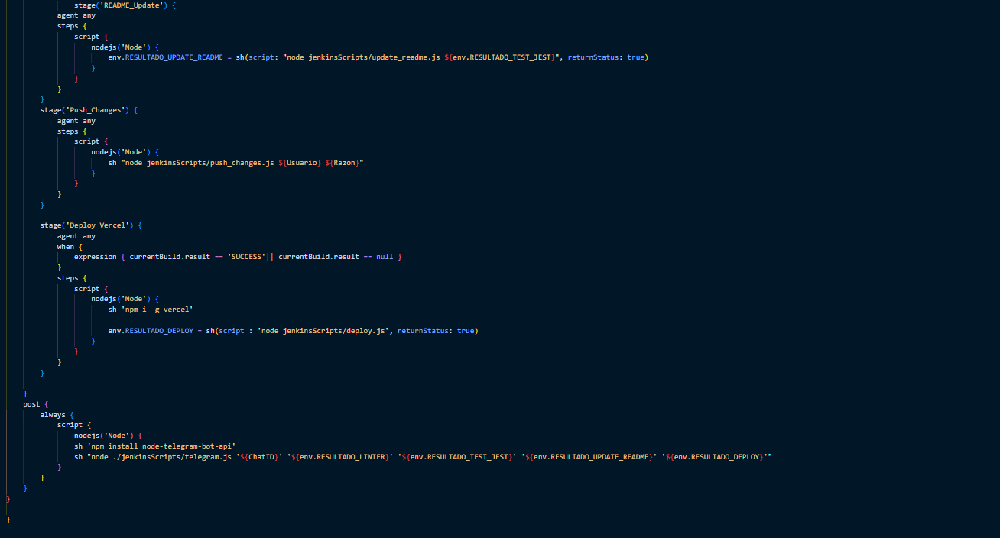

### Pas 6: Instal·lar el plugin Build Monitor View
Instal·la el plugin des de l'apartat "Administrar Jenkins" > "Plugins" > "Available plugins".
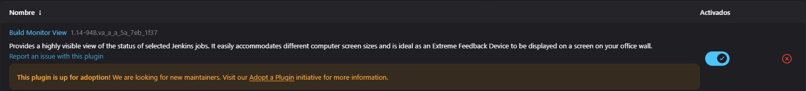

### Pas 7: Creació de la pràctica Jenkins
Crea una branca "ci_jenkins" per treballar sense afectar la branca principal.

### Pas 8: Petició de dades
Utilitza el següent element per a la petició de dades al Jenkinsfile:

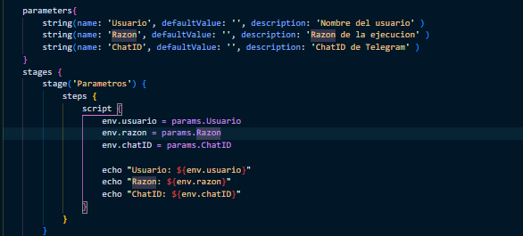

### Pas 9: Linter Stage
Configura el linter per revisar el codi i assegurar que compleix amb les regles establertes.
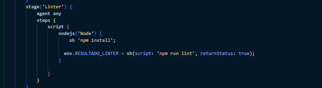

### Pas 10: Test Stage
Realitza tests simples sobre la funció "handler" ubicada en el fitxer "pages/api/users/index.js".
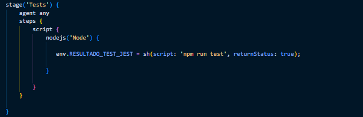

### Pas 11: Build Stage
Crea una versió empaquetada del projecte per desplegar-lo a Vercel.
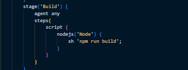

### Pas 12: Update Readme
Utilitza el següent script per actualitzar el README.md:
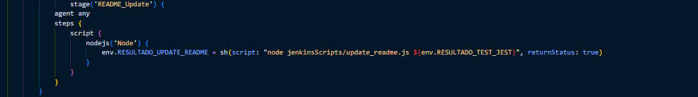

### Pas 13: Push Changes
Afegeix els canvis, fes commit i push al repositori remot.
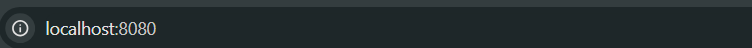

### Pas 14: Deploy to Vercel
Desplega el projecte a Vercel utilitzant les credencials configurades.
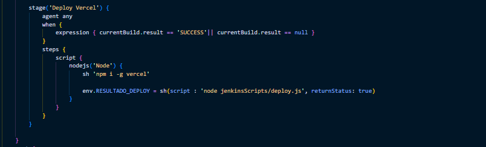

### Pas 15: Notificació Telegram
Utilitza un token de Telegram per enviar notificacions al bot amb el resultat de la pipeline.
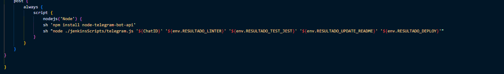